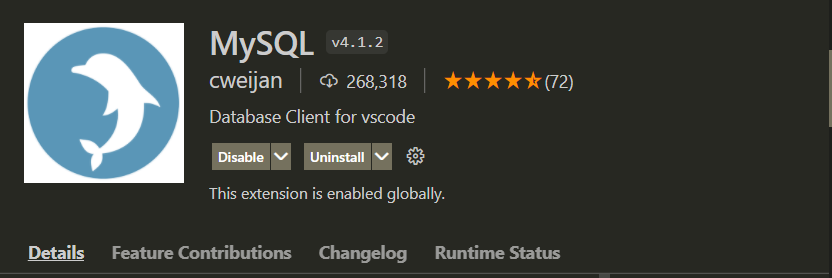

# vscode 오류 목록

## vscode mysql extension이 작동하지 않는 문제
  
- mysql연동한 Node.js 백엔드 작성 중 이것으로 익스텐션을 사용해 보았으나  
  
- &#43; 버튼을 눌러도 활성화가 되지 않는 버그 발생  

### 해결
- 오류 문서를 찾는데 실패하여  
[여기 어딘가는 있겠지만...](https://github.com/formulahendry/vscode-mysql/issues)  
  
- 그냥 익스텐션을 바꾸어서 해결하였다.  
  
- 이쪽은 연결이 잘 된다.  

### 추측하기로는 내 컴퓨터에 mysql이 이미 있고 비밀번호 설정까지 이미 되어있어서 설정 충돌..? 경로 충돌? or 익스텐션 버전 오류..? 
일단 보류

---

